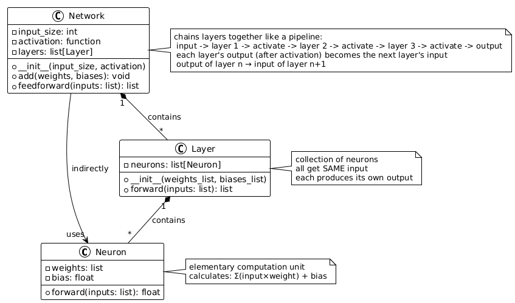

<!-- # toyceptron
A simple implementation of a Perceptron neural network in Python for educational purposes. -->
<a id="fr"></a>

<div align="center">
  <a href="#en">EN</a> · 
  <a href="#fr">FR</a>

# Toyceptron
</div>

Toyceptron est un projet pédagogique dont le but est de comprendre le fonctionnement interne d’un perceptron multi-couches en l’implémentant entièrement en Python, sans bibliothèques externes.

Le principe est simple : construire un réseau de neurones minimal pour mieux en comprendre les mécanismes fondamentaux.

## Objectif

Implémenter un réseau de neurones capable de :
- être initialisé avec des poids et biais fixes ou aléatoires
- effectuer une propagation avant (forward pass)
- produire une sortie à partir d’un vecteur d’entrée

Il n’y a pas d’apprentissage dans ce projet.

## Contraintes

- Langage : Python
- Aucune bibliothèque externe autorisée (numpy, pytorch, sklearn, etc.)
- Les vecteurs sont représentés avec des listes Python
- Le fichier `main.py` est fourni et sert de test

## Structure du projet

toyceptron/
├── neuron.py # Neurone individuel
├── layer.py # Couche de neurones
├── network.py # Réseau de neurones
├── main.py # Script de test
└── README.md

## Composants



### Neuron
Un neurone stocke ses poids et son biais et calcule une sortie à partir d’un vecteur d’entrée.

### Layer
Une couche est un ensemble de neurones identiques. Elle applique une entrée à tous ses neurones et retourne un vecteur de sorties.

### Network
Le réseau est une composition de couches. Il propage une entrée à travers l’ensemble des couches et retourne la sortie finale.

## Fonctions d’activation

Les fonctions suivantes sont supportées :
- identité
- seuil
- sigmoïde
- ReLU

## Exécution

``` bash
python main.py
```

## Compétences abordées

- Python
- Programmation orientée objet
- Bases des réseaux de neurones
- Compréhension du forward pass

Projet réalisé dans un cadre pédagogique.

<a id="en"></a>

<div align="center">
  <a href="#en">EN</a> · 
  <a href="#fr">FR</a>

# Toyceptron
</div>

Toyceptron is an educational project aimed at understanding the internal
workings of a multi-layer perceptron by implementing it entirely in Python,
without external libraries.

The principle is simple: build a minimal neural network to better understand its
fundamental mechanisms.

## Objective

Implement a neural network capable of:
- being initialized with fixed or random weights and biases
- performing a forward pass
- producing an output from an input vector

There is no training in this project.

## Constraints

- Language: Python
- No external libraries allowed (numpy, pytorch, sklearn, etc.)
- Vectors are represented using Python lists
- The `main.py` file is provided and serves as a test

## Project Structure

toyceptron/ ├── neuron.py # Individual neuron ├── layer.py # Layer of neurons ├──
network.py # Neural network ├── main.py # Test script └── README.md

## Components


### Neuron
A neuron stores its weights and bias and calculates an output from an input
vector.

### Layer
A layer is a collection of identical neurons. It applies an input to all its
neurons and returns a vector of outputs.

### Network
The network is a composition of layers. It propagates an input through all
layers and returns the final output.

## Activation Functions

The following functions are supported:
- identity
- threshold
- sigmoid
- ReLU

## Execution

``` bash
python3 main.py
```

## Skills Covered

- Python
- Object-oriented programming
- Neural network basics
- Understanding the forward pass

Educational project.