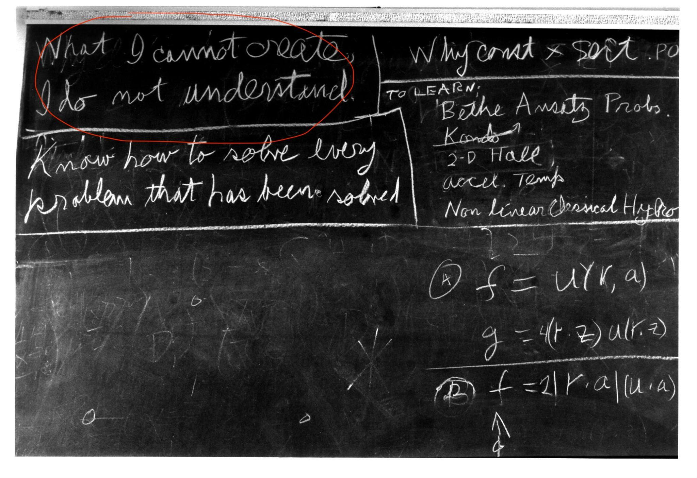
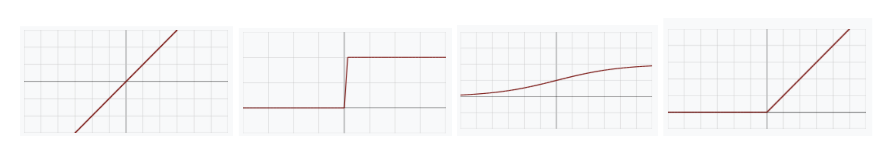

  <a href="#en">EN</a> · 
  <a href="#fr">FR</a>

# Toyceptron
*Un vrai réseau de neurones, sans magie ni libs externes - v1.2*

## Introduction

L'objectif de ce projet est de **comprendre la structure d'un perceptron multi-couches**, aussi appelé "réseau de neurones". Et quelle meilleure façon de comprendre qu’en faisant ?

*Tableau noir de Richard Feynman à sa mort (1988) : “What I cannot create I do not understand”. Il faut construire pour comprendre.*

L’objectif de votre perceptron est de **démystifier et comprendre les principes d’un réseau de neurones**.

## Le projet

Vous allez **créer un perceptron en Python**, un modèle de réseau de neurones simple qui prend une entrée (un vecteur) et produit une sortie (un scalaire). Le comportement de votre réseau de neurones dépendra uniquement de ses paramètres initiaux (vous n’aurez pas à [entraîner](https://fr.wikipedia.org/wiki/Apprentissage_supervis%C3%A9) votre modèle).

À la fin de la semaine, votre réseau devra pouvoir être initialisé aléatoirement ou avec des paramètres pré-définis, et **faire une forward pass depuis l'entrée jusqu'à la sortie**. Et c'est tout !

## Contraintes

Le langage utilisé sera Python. Aucune bibliothèque externe n'est autorisée (`numpy`, `pytorch`, `sklearn.`..). **Vous utiliserez les listes de Python comme vecteurs** (inefficientes mais conceptuellement simples).

Le `main.py` de test est fourni. Votre rôle sera uniquement d'implémenter les classes demandées pour faire fonctionner ce main.

## Implémentation

Vous devrez en tout et pour tout définir **trois classes** :

1. La classe `Neuron` (dans `neuron.py`)

    Un neurone représente une unité de calcul élémentaire. Il doit pouvoir *a minima* :
    - **stocker** ses poids et son biais,
    - **calculer sa sortie** à partir d'un vecteur d'entrées.

    Les poids et le biais seront aléatoires **ou** fixés à la création. La fonction d'activation sera définie au niveau du réseau : pas besoin de la stocker dans chaque neurone.

2. La classe `Layer` (dans `layer.py`)

    Une **couche** est une **collection ordonnée de neurones identiques**. Elle doit pouvoir :
    - créer/stocker plusieurs `Neuron`,
    - appliquer à tous ses neurones un vecteur d'entrée et produire un vecteur de sortie.

    Tous les neurones d'une couche auront le même nombre d'entrées. On suppose le réseau totalement relié (fully-connected).

3. La classe `Network` (dans `network.py`)

    Le **réseau** est une **composition de couches**. Il doit :
    - créer une architecture complète à partir d'hyperparamètres (fournis),
    - faire circuler un vecteur d'entrée à travers toutes les couches et retourner la sortie finale.

    Lors de la création du réseau, on doit pouvoir spécifier au minimum :
    - le nombre de couches,
    - la taille de chaque couche,
    - la fonction d'activation,
    - l’initialisation des poids et biais (valeurs fixes ou règles simples)

    Ces hyperparamètres seront passés au constructeur de `Network`.

Vous devrez proposer au moins ces **quatre fonctions d'activation simples** :
[identité](https://fr.wikipedia.org/wiki/Application_identit%C3%A9), [seuil](https://fr.wikipedia.org/wiki/Fonction_de_Heaviside), [sigmoïde](https://fr.wikipedia.org/wiki/Sigmo%C3%AFde_(math%C3%A9matiques)), [ReLU](https://fr.wikipedia.org/wiki/Redresseur_(r%C3%A9seaux_neuronaux)) (la sigmoïde vous est donnée dans le main).

*1. Identité, 2. Seuil, 3. Sigmoïde, 4. ReLU*

## Bonus

Ces bonus sont grosso modo rangés par ordre croissant de difficulté, mais vous pouvez les aborder dans l’ordre de votre choix. Ils ne sont à faire qu’une fois la partie obligatoire réalisée !

- Ajouter une méthode `summary()` dans `Network` qui affiche son architecture (nombre de couches, tailles, activation)
- Ajouter des vérifications d’erreurs claires, notamment à la création si les tailles sont incompatibles entre couches
- Permettre des activations différentes par `Layer`, voire par `Neuron`
- Ajouter une couche d’entrée explicite (qui ne fait que récupérer l’input)
- Implémenter une fonction `forward_debug()` qui affiche toutes les sorties intermédiaires
- Implémenter un perceptron binaire (= dont l’output est un scalaire) qui approxime les fonctions AND et OR, avec des poids fixés à la main
- Montrer qu’un réseau sans couche cachée ne peut pas représenter la fonction XOR
- Ajouter une notion de batch (liste de vecteurs en entrée), pour accélérer le traitement
- Utiliser `numpy` sur tout le projet (attention, ceci seulement si vous avez réussi avec des listes simples)
- Implémenter une couche spéciale identité (“pass-through”), pour illustrer la “profondeur inutile” dans un RN
- Ajouter une sérialisation simple du réseau dans un fichier externe, pour une sauvegarde/chargement des poids. Le fichier peut avoir le format de votre choix : n’importe quel format texte fonctionne très bien (txt, csv…), mais vous êtes libre de choisir un format binaire. Pas de lib autorisée pour la sérialisation !

## Compétences visées

- Python
- POO
- Machine Learning

## Rendu
Le projet est à rendre sur votre github : https://github.com/prenom-nom/toyceptron

## Base de connaissances

- [`main.py` de test](https://drive.google.com/file/d/1oVIhfvYuxBufNvCOBjMjfBtyPv8aoCV5/view?usp=sharing)
- [Article du perceptron](https://fr.wikipedia.org/wiki/Perceptron)
- [Vidéo de 3blue1brown](https://www.youtube.com/watch?v=aircAruvnKk) sur les réseaux de neurones
- [Un playground](https://playground.tensorflow.org) pour jouer avec un réseau simple
- [W3Schools](https://www.w3schools.com/ai/) "Learning machines to imitate human intelligence"

  <a href="#en">EN</a> · 
  <a href="#fr">FR</a>

# Toyceptron
*A real neural network, without magic or external libraries - v1.2*

## Introduction

The objective of this project is to **understand the structure of a multi-layer perceptron**, also called a "neural network". And what better way to understand than by building it yourself?

*Richard Feynman's blackboard at his death (1988): "What I cannot create I do not understand". You must build to understand.*

The objective of your perceptron is to **demystify and understand the principles of a neural network**.

## The Project

You will **create a perceptron in Python**, a simple neural network model that takes an input (a vector) and produces an output (a scalar). The behavior of your neural network will depend only on its initial parameters (you will not have to [train](https://en.wikipedia.org/wiki/Supervised_learning) your model).

By the end of the week, your network must be able to be initialized randomly or with pre-defined parameters, and **perform a forward pass from input to output**. That's it!

## Constraints

The language used will be Python. No external libraries are allowed (`numpy`, `pytorch`, `sklearn`...). **You will use Python lists as vectors** (inefficient but conceptually simple).

The test `main.py` is provided. Your role will be only to implement the required classes to make this main work.

## Implementation

You must define exactly **three classes**:

1. The `Neuron` class (in `neuron.py`)

    A neuron represents an elementary computational unit. It must be able to *at minimum*:
    - **store** its weights and its bias,
    - **compute its output** from a vector of inputs.

    The weights and bias will be random **or** fixed at creation. The activation function will be defined at the network level: no need to store it in each neuron.

2. The `Layer` class (in `layer.py`)

    A **layer** is an **ordered collection of identical neurons**. It must be able to:
    - create/store multiple `Neuron`,
    - apply a vector of input to all its neurons and produce a vector of output.

    All neurons in a layer will have the same number of inputs. We assume the network is fully connected.

3. The `Network` class (in `network.py`)

    The **network** is a **composition of layers**. It must:
    - create a complete architecture from hyperparameters (provided),
    - circulate an input vector through all layers and return the final output.

    When creating the network, you must be able to specify at minimum:
    - the number of layers,
    - the size of each layer,
    - the activation function,
    - the initialization of weights and biases (fixed values or simple rules)

    These hyperparameters will be passed to the `Network` constructor.

You must provide at least these **four simple activation functions**:
[identity](https://en.wikipedia.org/wiki/Identity_function), [threshold](https://en.wikipedia.org/wiki/Heaviside_step_function), [sigmoid](https://en.wikipedia.org/wiki/Sigmoid_function), [ReLU](https://en.wikipedia.org/wiki/Rectifier_(neural_networks)) (the sigmoid is provided in the main).

*1. Identity, 2. Threshold, 3. Sigmoid, 4. ReLU*

## Bonus

These bonuses are roughly ordered in increasing order of difficulty, but you can tackle them in any order. They are only to be done once the mandatory part is completed!

- Add a `summary()` method to `Network` that displays its architecture (number of layers, sizes, activation)
- Add clear error checks, particularly at creation if the sizes are incompatible between layers
- Allow different activations per `Layer`, or even per `Neuron`
- Add an explicit input layer (which only retrieves the input)
- Implement a `forward_debug()` function that displays all intermediate outputs
- Implement a binary perceptron (= whose output is a scalar) that approximates the AND and OR functions, with weights manually fixed
- Show that a network without a hidden layer cannot represent the XOR function
- Add a batch notion (list of input vectors), to speed up processing
- Use `numpy` on the entire project (warning, this only if you succeeded with simple lists)
- Implement a special identity layer ("pass-through"), to illustrate "unnecessary depth" in a NN
- Add simple serialization of the network to an external file, for saving/loading weights. The file can be in any format of your choice: any text format works very well (txt, csv…), but you are free to choose a binary format. No lib allowed for serialization!

## Target Skills

- Python
- OOP
- Machine Learning

## Submission
The project is to be submitted on your github: https://github.com/first-name-last-name/toyceptron

## Knowledge Base

- [`main.py` test file](https://drive.google.com/file/d/1oVIhfvYuxBufNvCOBjMjfBtyPv8aoCV5/view?usp=sharing)
- [Perceptron article](https://en.wikipedia.org/wiki/Perceptron)
- [3Blue1Brown video](https://www.youtube.com/watch?v=aircAruvnKk) on neural networks
- [A playground](https://playground.tensorflow.org) to play with a simple network
- [W3Schools](https://www.w3schools.com/ai/) "Learning machines to imitate human intelligence"